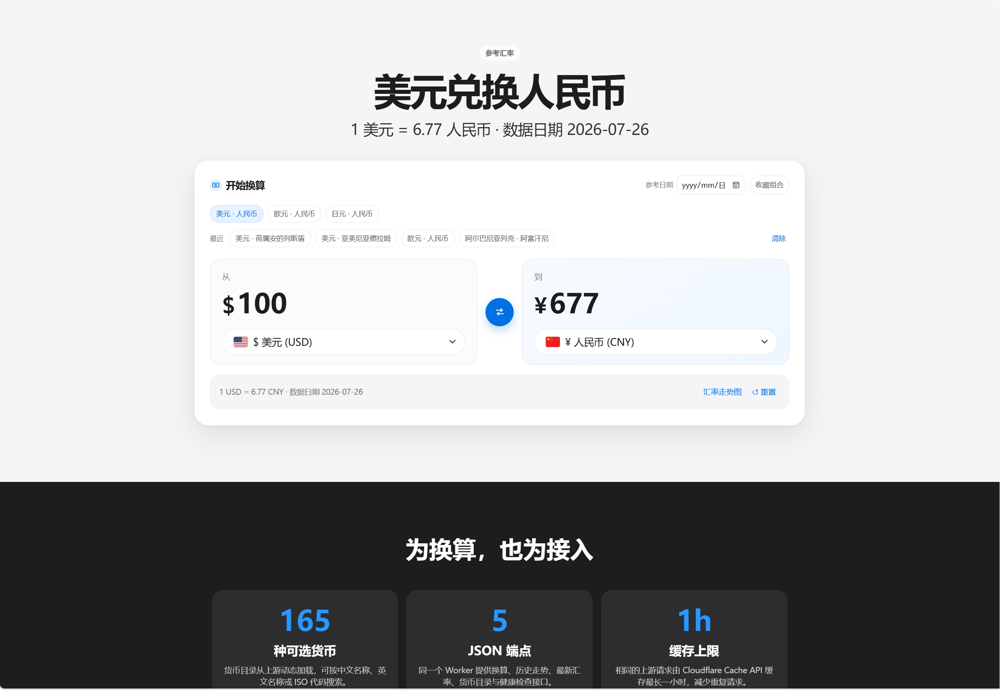

# Monea Currency

<p align="center">
  
</p>

> 全球货币，轻松换算。

一个部署在 Cloudflare Workers 上的汇率换算工具，提供简洁的网页界面与 JSON API。

## 功能

- 覆盖多种货币，支持搜索与快捷换算
- 提供 `/convert`、`/history`、`/latest`、`/currencies` 和 `/health` API
- 使用 Cloudflare 边缘缓存：最新汇率 5 分钟、走势与指定历史日期 24 小时、货币目录 7 天；上游短暂异常时回退最近一次成功结果
- 无需 API Key
- 默认展示 Frankfurter 汇聚的多家央行参考汇率，并非实时交易报价

## 本地运行

```bash
pnpm install
pnpm dev
```

部署：

```bash
pnpm deploy
```

## API 示例

```text
GET /convert?from=USD&to=CNY&amount=100
GET /history?from=USD&to=CNY&range=1M
GET /latest?base=USD
GET /currencies
GET /health
```

`/latest` 为每个货币分别返回数据日期，避免将不同来源的更新时间误写为同一天：

```json
{
  "base": "USD",
  "rates": {
    "CNY": { "rate": 6.77, "date": "2026-07-26" }
  }
}
```

所有端点仅接受 `GET`（`OPTIONS` 用于 CORS 预检）。`amount` 必须是非负十进制数。

## 测试

```bash
pnpm test
```

测试使用 Cloudflare Workers 的 Vitest 集成，在本地 `workerd` 运行。

## 致谢

汇率数据由开源项目 [Frankfurter](https://frankfurter.dev/) 提供。感谢其维护免费的货币数据 API 与公开数据来源；如需合规用途，请通过其 `providers` 参数选择对应的官方数据源。
